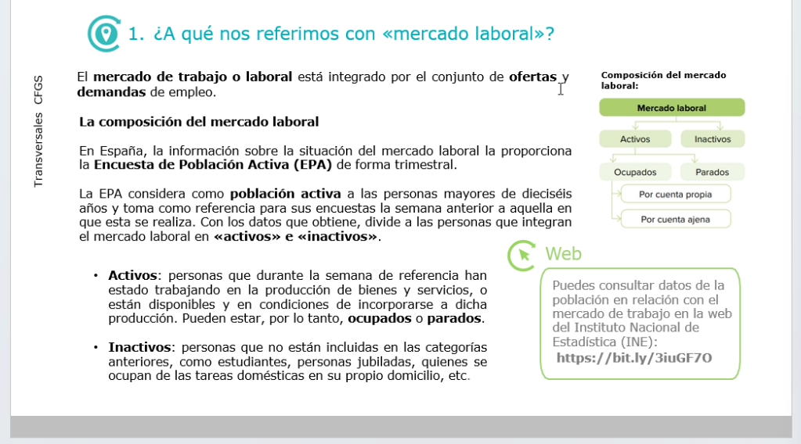
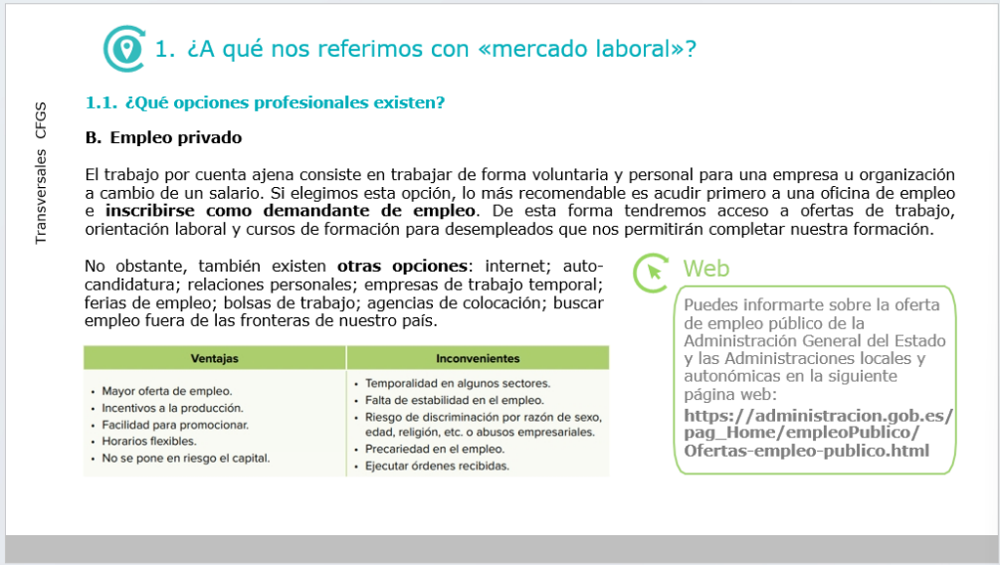
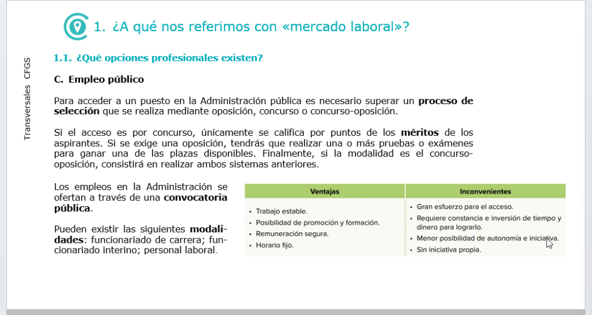
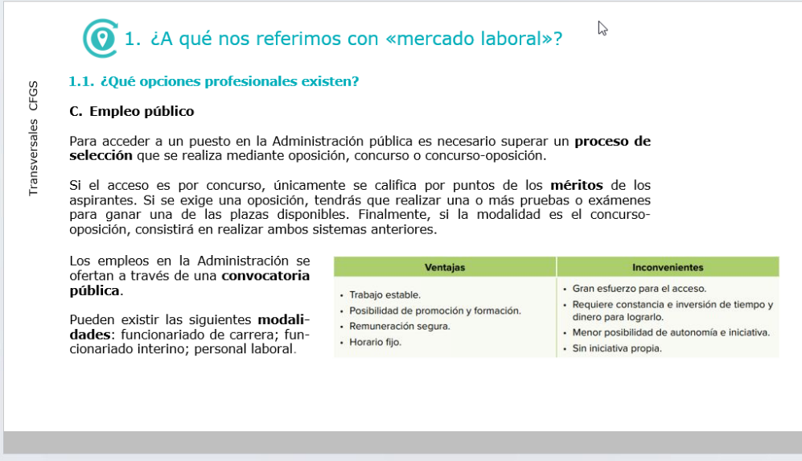
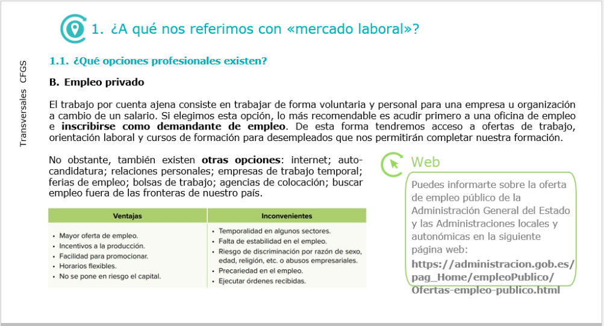
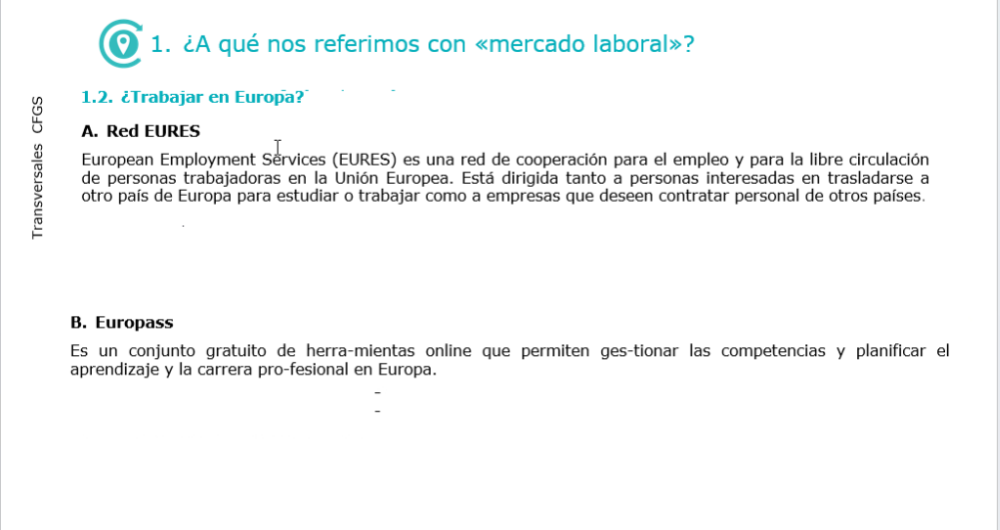
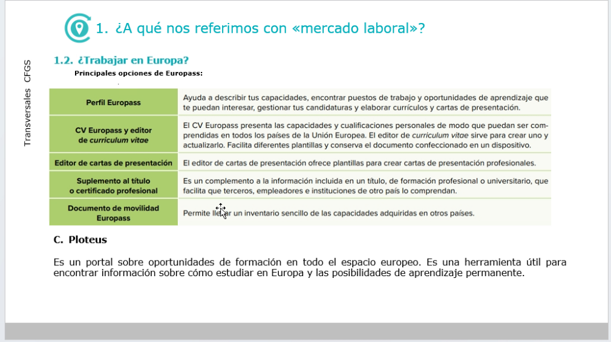
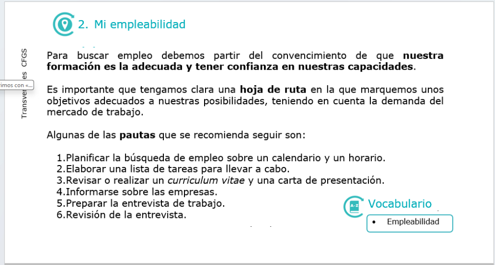
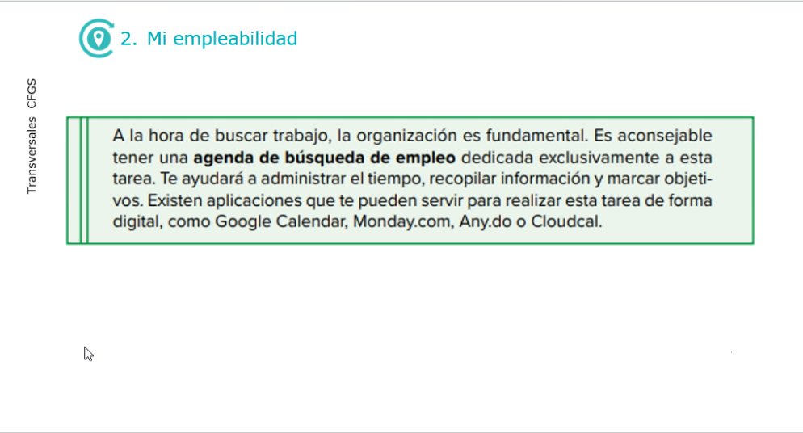
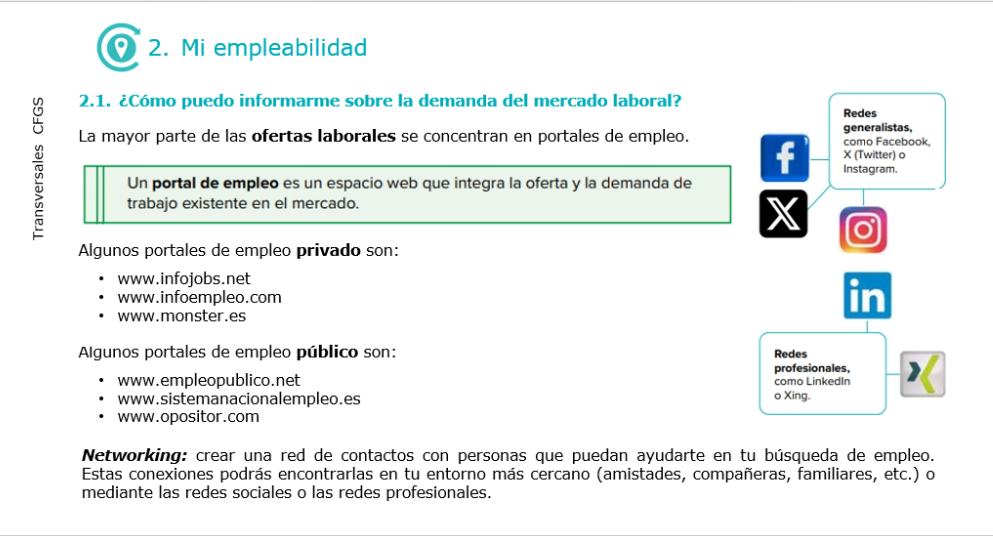

TECNOEMPRENDEDOR:
 es una persona que crea y dirige un **negocio enfocado en la tecnologia** para resolver problemas reales mediante la innovacion y modelos de negocio escalables.
 - caracteristicas 

Emprendedor Social: 
una persona que crea y lidera una iniciatica o negocio con el objetivo principal de resolver un problema social, ambiental o de desigualdad, utilizando metrodos innovadores y un modelo autosostenible
--- son personas que inician y desarrollan un proyecto de estas caracteizticas, priorizando  el impacto social por encima del beneficio economica. 

AUTONOMO: 
Una persona que realiza una actividad economica de forma habitual, personal y directa por **cuenta propia**, sin un cotrato laboral que la vincule a un empleador. 
- caracteristica no tiene jefe, ni un nomina fija; emites factura a tus clientes por los servicios realizados o productos. Ingresos variables. las ganancias dependen de los clientes. 

explicar las consecuencia que tiene para la sociedad el formato del trabajo por cuenta propia y la creacion de empresas. 
...

conoces como se compone el mercado laboral?

sabes como acceder al empleo publico?

 1 - ¿A qué nos referimos con "Mercado laboral"?
mercado laboral:

esta integrado por el conjunto de oferta de demanda y empleo.
 **La coposicion del mercado laboral**  
 En españa, la informacion sobre la situacion del mercado laboral la proporciona la Encuensta de Poblacion Activa (EPA) de forma trimestral.

La EPA considera como persona activa o poblacion activa a personas a mayores de 16 años y toma como referencia para sus encuesta la semana anterior a aquella que esta se realiza. Con los datos que obtiene, divide a las personas que integran el mercado laboral en **activos e inactivos**

 - Activos: personas que durante la semana de referencia han trabajado en la producción de bienes y servicio o están diponbibles y en condiciones de incorporarse a dicha producción. Pueden estar por lo tanto ocupados o parados.

- Inactivos personas que no estan en las categorias anteriores, como estudiantes, personas jubiladas, quienes se ocupan de las tareas domesticas en su propio domicicio etc.

1.1 ¿ Que opciones profesionales existen?

A. Autoempleo 
la incorporacion al mundo laboral se puede hacer por medio del desarrollo de una idea de negocio. El autoempleo consiste en trabajar por cuenta propia a través de la creación de una empresa, adoptando cualquiera de las formas juridicas posibles. 

verntajas: independencia y autonomia
satisfaccion personal
Reconocimiento social
Posibilidad de mayores ingresos
Libertad para organizar el tiempo. 

inconvenientes: Dedicacion maxima sin horarios fijos.
el inicio requiere un gran esfuerzo
incertidumbre y asuncion de riesgos economicos
su estabilidad depende del mercado, la economia, la competencia, etc. 

1.1 ¿Qué opciones profesiones existen?

Empleo Privado. 

El trabajo por cuenta ajena consiste en trabajar de forma voluntaria y personal para una empresa u organizacion a cambio de un salario. Si elegimos esta opcion, lo más recomendable es acudir primero a una oficina de empleo e inscribirse como demandante de empleo. De esta forma tendremos acceso a ofertas de trabajo, orientacion laboral y cursos de formacion para desempleados que nos permitiran completar nuestra formacion para desempleados que nos permitan completar nuestra formacion. 
No obstante, tambien existen otras opciones: internet; autocandidatura; relaciones personales; empresas de trabajo temporal; ferias de empleo; bolsas de trabajo; agencias de colocacion; buscar empleo de las fronteras de nuestros pais. 

Ventajas:
Mayor oferta de empleo
incentivos a la produccion
facilidad para promocionar
horarios flexibles
no se pone en riesgos el capital 

Inconvenientes:
Temporalidad en algunos sectores.
Falta de estabilidad en el empleo 
Riesgo de discriminacion por razon de sexo, edad, religion, etc. o abusos empresariales.
Precariedad en el empleo
Ejecutar ordenes recibidas

---

1.1 ¿

Empleo publico
una oposicion es un examen...*
concurso oposicion...* Burcar exactamente 

Que opciones profesiones existen?

Para acceder a un puesto en la administracion publica es necesario superar un proceso de seleccion que se realiza mediante oposicoin, concurso o consurso-oposicion. 

Si el acceso es el consurso, unicamente se califica por puntos de los meritos de los aspirantes. S i se exige una oposicion, tendras que realizar una mas pruebas o examenes para ganar una de las plazas disponibles. Finalmente, si la modalidad es el concurso oposicion, consistira en realizar ambos sistemas anteriores.

Los empleos en la administracion se ofertan a traves de una convocatoria publica. 
Pueden existir la siguiente modalidades: funcionariado de carrera; funcionariado interino; personal laboral. 

Ventajas: trabajo estable, Posibilidad de promocion y formacion, remuneracion segura, horario fijo

Incovenientes: Gran esfuerzo para el acceso.
Requiere constancia e inversion de tiempo y dineropara lograrlo, 
Menor posibilidad de autonomia e iniciativa.
sin iniciativa propia

boe (boletin oficial del estado) y boa(boletin oficial de andalucia )

¿Trabajar en Europa?

A. Red EURES 
European Employment Service (EURES) es una red de cooperación para el empleo y para la libre circulación de personas trabajadoras en la Union Europea. Está dirigida tanto a personas interesadas en trasladarse a otro país de Europa para estudiar como a empresas que deseen contratar personal de otro países.

B. Europass
Es un conjunto gratuito de herra-mientas online que permite ges-tionar las competencias y planificar el aprendizaje y la carrera pro-fesional en Europa. 

¿trabajar en Europa?

Principales opciones de Europass:
Perfil Europass: Ayuda a describir tus capacidades, encontrar puestos de trabajo y oportunidades de aprendizaje que te pueden interesar, gestion tus candidaturas y elaborar curriculos y cartas de presentacion.
CV Europass y editor de curriculu vitae:
El CV Europass presenta las capacidades y cualificaciones personales de modo que pueden ser comprendidas en todo los paises de la Union Europea. El editor de curriculum vitae sirve para crear uno y actualizarlo. Facilita diferentes plantillas para crear y conserva el documento confeccionado en un dipositivo.
Edito de cartas de presentacion :
Suplemento al titulo o certificado profesional
Documento de movilidad Europass:

Ploteus 
Es un portal sobre oportunidades de formacion en todo el espacio europeo. Es una herramienta util. 

Mi empleabilidad
Para buscar empleo debemos partir del convencimiento de que nuestra formacion es la adecuada y tener confianza en nuestras capacidades.

Es importante que tengamos clara una hoja de ruta en la que marquemos unos objetivos adecuados a nuestras posibilidades, teniendo en cuenta la demanda del mercado de trabajo.

Algunas de las Pautas que se recomienda seguir son:

1.Planificar una busquedas de empleo sobre un calendario y horario.
2.Elaborar una lista de tareas para llevar a cabo.
3.Revisar o relizar un curriculum vitae y una carta de presentacion.
4.Informarse sobre las empresas.
5.Preparar la entrevista de trabajo.
6.Revisión de la entrevista. 

Ala hora de buscar trabajo, la organizacion es fundamental. Es aconsejable

¿Como puedo informarme sobre la demanda del mercado laboral ?
La mayor parte de la oferta laborales se concentran en portales de empleo.
Un portal de empleo es un espacio web que integran la oferta y la demanda de trabajo existe en el mercado.

Algunos portales de empleo privado son:
- infojobs.net
- infoempleo.com
- monster.es
Algunos portales de empleo publico son:
- empleopublico.net
- sistemanacionalempleo.es
- opositor.com

Networking: crear una red de contactos con personas que pueden ayudarte en tu busqueda de empleo.
Estas conexion podras encontrarlas en tu entorno mas cercano(amistades, compañeras.familiares.etc.) o mediante las redes sociales o las redes profesionels. 

A que nos referimos con marcado laboral?

¿Trabajar en europa?

perfil europass: Ayuda a describir tus capacidades, encontrar puestos de trabajo y oportunidades de aprendizaje que te pueden interesar, gestionar tus candidaturas y elaborar curriculos y cartas de presentacion

CV Europass y editor de curriculum vitae: El Cv Europass, presenta las capacidades y calificaciones personales de modo que puede ser comprendida en todos los paises de la union europea. El editor de curriculum vitae sirve para crear uno u actualizarlo. Facilita difirentes plantillas y conservar el documetno confeccionado en un dispositivo. 

SUPLEMENTO AL TITULO O CERTIFICADO PROFESIONAL
dOCUMENTO MOVILIDAD.

Para buscar empleo debemos partir del convencimiento de que nuestras formacion es la decuada y tener confianza en nuestras capacidades. 

importante una hoja de ruta. en que marquemos adecuadamente nuestras posibilidades teniendo en cuenta la demanda del mercado 
recomendaciones:

Planifificar la busqueda de empleo sobre un calendario y un horario
Elaborar una lista de tareas para llevar a cabo
revisar o realizar CV y carta de presentacion
informarse sobre empresas
preparar la entrevista de trabajo
Revision de la entrevista.

la mayor parte de las ofertas laborales se concentran en portales de empleo. 

un portal de empleo es un espacio web que integran la oferta y la demanda de trabajo existente ene l mercado

Privados:
infojob
monster
infoempleo

publicos:
empreopublico.net
sistemanacionalempleo.es
opositor.com

perfil profesional, nuestras caracteristicas tiene que estara lineadas con la demanda de empresas para poder cubrir los puestos de trabajos ofertados

Un perfil Profesional es una descripcion de las caracteristicas tecnicas, personales y sociales, asi como de la expèriencia de una persona, para poder afrontar las tareas y responsabilidadesd e un puesto de trabajo

un profesiograma 
es una herramienta que realizan los despartamentos de recursos humanos de las empresas para facilitar el proceso de seleccion de aspirantes.
su objetivo es si la persona candidata se ajusta al puesto concreto. 
la reputacion en linea o digital es el prestigio de una persona o una compañia en internet. 
La publicaciones y las interacciones con otras personas afectana la reputacion. 

Eleccion profesion
elemento que condicionan nuestra eleccion profesional son situacion perfonal; formacion; experiencia profesional previa en el mismo sector o en otros; aficciones; vicnulacion a asociaciones;
caracteristicas familiares; entorno social; condiciones economicas; entorno social; condiciones economicas

para la totams de decisiones es muy util realizar un analisis DAFO ( debilidades, amenazas, fortaleza y oportunidades)

debilidades:
dificultad para explicar conceptos tecnicos

fortaleza conocimientos y capacidad de aprendizaje 
amenazas demandas de cambios en lenguajes de lenguajes de programacion
oportunidades: posibilidad de trabajar en remoto. 